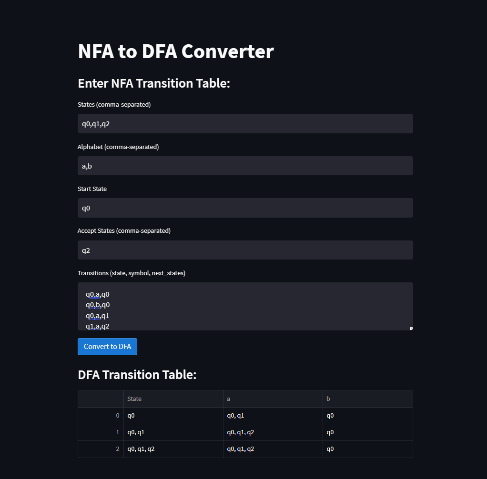

# NFA to DFA Converter

[Streamlit deployed link](https://nfatodfaconverter.streamlit.app/)

This Streamlit application converts a Non-Deterministic Finite Automaton (NFA) into a Deterministic Finite Automaton (DFA) using the provided transition table.

## Table of Contents
- [Prerequisites](#prerequisites)
- [Installation](#installation)
- [Usage](#usage)
- [Input](#input)
- [Output](#output)
- [Run the Application](#run-the-application)

## Prerequisites

Before running the application, ensure that you have the following dependencies installed:
- Python 3.x
- Streamlit
- Pandas

## Installation

1. Clone the repository to your local machine:

    ```bash
    git clone https://github.com/Astrasv/NFAtoDFA-converter.git
    ```

2. Navigate to the project directory:

    ```bash
    cd NFAtoDFA-converter
    ```

3. Install the required Python packages using pip:

    ```bash
    pip install -r requirements.txt
    ```

## Usage

The application provides a user interface for entering the NFA transition table and converting it into a DFA. Here's how to use it:

### Input

1. Enter the states of the NFA, alphabet, start state, and accept states in the corresponding input fields.
2. Provide the NFA transition table in the "Transitions (state, symbol, next_states)" text area. Each transition should be in the format `state, symbol, next_states` and separated by newlines.

### Output

Once the input is provided, click the "Convert to DFA" button. The application will convert the NFA transition table into a DFA transition table and display it in a DataFrame format.



### Run the Application

To run the application, execute the following command in your terminal:

```bash
streamlit run streamlit_nfa_to_dfa.py
```

This command will start a local Streamlit server, and the application will be accessible in your web browser at `http://localhost:8501`.

## License

This project is licensed under the MIT License - see the [LICENSE](LICENSE) file for details.
